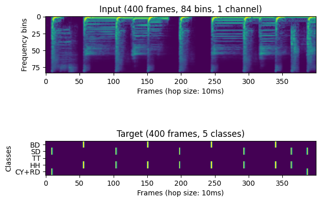

# ADTOF
This repository contains additional material for the papers:
- M. Zehren, M. Alunno, and P. Bientinesi, “ADTOF: A large dataset of non-synthetic music for automatic drum transcription,” in Proceedings of the 22st International Society for Music Information Retrieval Conference, Online, 2021, pp. 818–824.
- Zehren, M.; Alunno, M.; Bientinesi, P. High-Quality and Reproducible Automatic Drum Transcription From Crowdsourced Data. Signals 2023, 1, 1–21.

<!-- Shield: [![CC BY-NC-SA 4.0][cc-by-nc-sa-shield]][cc-by-nc-sa] -->

The content of this repository is licensed under a
[Creative Commons Attribution-NonCommercial-ShareAlike 4.0 International License][cc-by-nc-sa].

<!-- [![CC BY-NC-SA 4.0][cc-by-nc-sa-image]][cc-by-nc-sa] -->

[cc-by-nc-sa]: http://creativecommons.org/licenses/by-nc-sa/4.0/
[cc-by-nc-sa-image]: https://licensebuttons.net/l/by-nc-sa/4.0/88x31.png
[cc-by-nc-sa-shield]: https://img.shields.io/badge/License-CC%20BY--NC--SA%204.0-lightgrey.svg

## Transcription
The easiest way to test the trained model is to access our [Colab Notebook](https://colab.research.google.com/drive/1G_UeWav_AMaaqfJxR4cVgH5EdrvsDQGT?usp=sharing).
Alternatively, you can run the transcription locally with this [Jupyter Notebook](/bin/drumTranscriptor.ipynb).

## Datasets
If you want to train your model, a copy of the `ADTOF` datasets is available upon request on [Zenodo](https://zenodo.org/doi/10.5281/zenodo.10084510). The datasets contain 359 hours of music annotated for automatic drum transcription. The data is available as mel-scale spectrograms. Once downloaded, the datasets can be loaded with this [Jupyter Notebook](/bin/importDataset.ipynb).

## Data cleansing procedure 
We also share the cleansing procedure used to build the datasets presented in the submission. You can build your version with the following steps.

### 1. Installation
To build the datasets or use the pre-trained ADT models, you first need to install dependencies. This can be done with the script [setup.py](./setup.py) with the following command line:

    pip3 install .

:warning: This repository has been tested on macOS Ventura with **Python 3.10**.

### 2. Download custom charts
To build the dataset you need to download rhythm video game charts. For example, from [Rhythm Gaming World](https://rhythmgamingworld.com/). :warning: we are not affiliated with Rhythm Gaming World and we do not control any material, possibly copyrighted, linked there.

### 3. Convert the custom charts to the `PhaseShift` file format
The charts you downloaded in the previous step are in different formats meant for different rhythm games. But the automatic cleansing requires that the charts downloaded are following specifically the `PhaseShift` file format (i.e. a folder containing a *song.ogg* and a *notes.mid* file). You can easily convert the charts downloaded to a good file format with the software [C3 CON Tools](https://rhythmgamingworld.com/forums/topic/c3-con-tools-v401-8142020-weve-only-just-begun/) (tested on Windows 10). After downloading and launching C3 CON Tools, the conversion is done on the graphical user interface following this procedure:
1. Click on **Phase Shift Converter**
2. Click on **Change Input Folder** and select the folder containing the custom charts previously downloaded
3. Click on **Begin**

### 4. Automatic grooming
The custom charts you downloaded and transformed into the `PhaseShift` file format can now be converted into a usable dataset with the script [/bin/automaticGrooming.py](/bin/automaticGrooming.py):

    automaticGrooming.py [-h] [-p] inputFolder outputFolder

    Process a chart folder with the automatic cleaning procedure

    positional arguments:
    inputFolder     Path to the chart folder.
    outputFolder    Path to the destination folder of the dataset.

    optional arguments:
    -h, --help      show this help message and exit
    -p, --parallel  Run the cleansing in parallel

### Update
Clear mapping from different datasets (e.g., [Slakh](https://github.com/ethman/slakh-generation)) to General MIDI has been added in the file [instrumentsMapping.py](./adtof/ressources/instrumentsMapping.py)